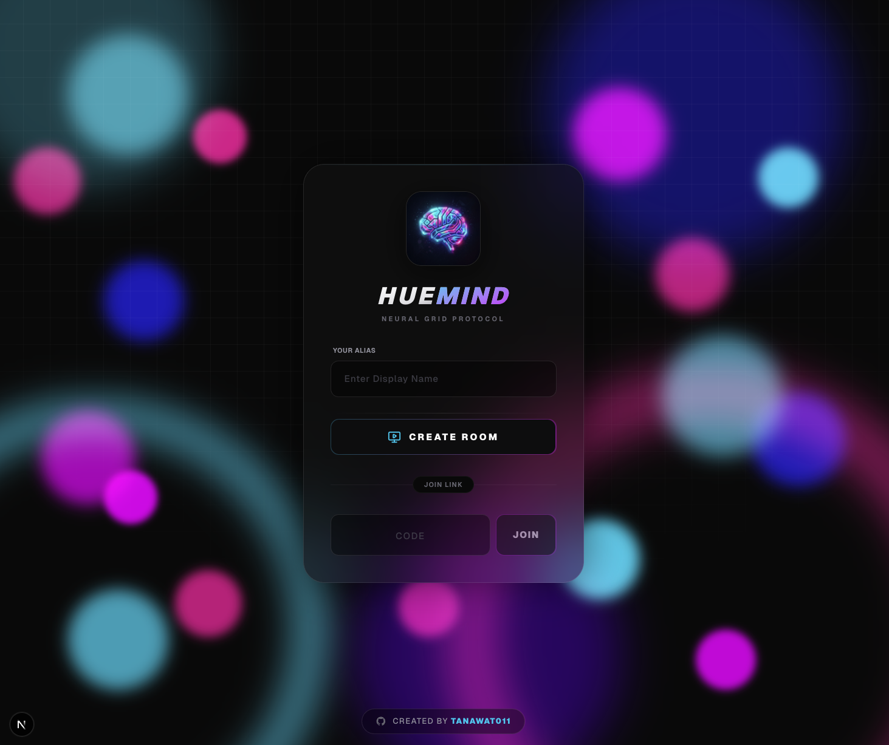
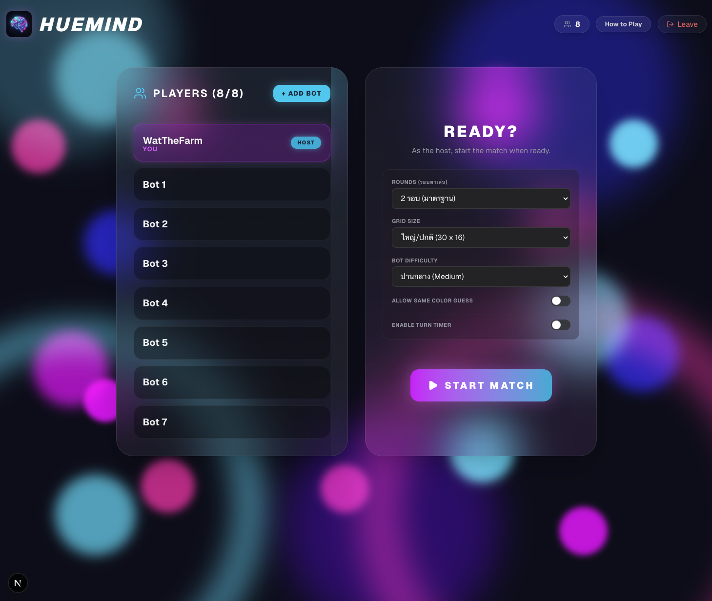
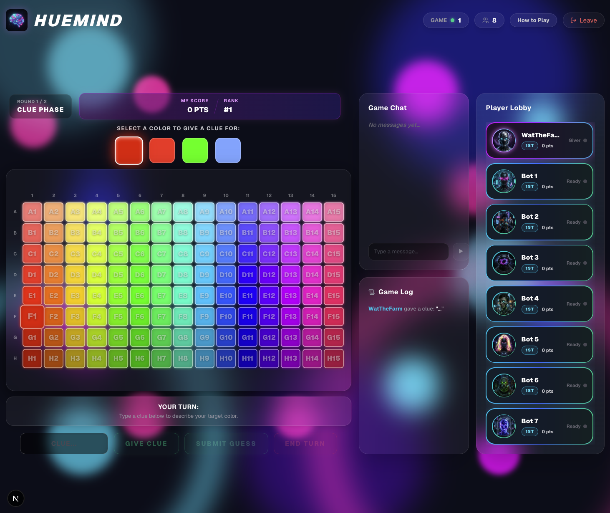

# 🎨 HueMind

> **HueMind** is a cyberpunk-themed, real-time multiplayer board game inspired by _Hues and Cues_. Connect players, give color hints, and guess your way perfectly onto the neon spectrum!

<div align="center">
  
  <br/>
  <i>Step 1: Create or join a room from the neural hub.</i>
  <br/><br/>
  
  <br/>
  <i>Step 2: Gather in the lobby with friends and configure AI bots.</i>
  <br/><br/>
  
  <br/>
  <i>Step 3: Dive into the neon spectrum and start guessing!</i>
</div>

## 📌 Features (v1.1.0)

- 🔥 **Real-Time Multiplayer**: Built with pure Next.js 15, React 19, and Tailwind CSS v4 running state synchronizations via Server-Sent Events (SSE).
- 🤖 **AI-Bot Integration**: Play against deterministic, intelligent bots that adapt to the clues and crowd the scoring zones perfectly.
- 💬 **Live Game Chat**: Chat with host, players, and bots seamlessly during matches! Fully isolated from the game board to ensure zero typing lag.
- 🏆 **Dynamic Shared Ranking**: Leaderboards update in real-time, matching "tied" players with identical neon badging using competitive dense-ranking mechanics.
- ⚡ **God-Tier Performance**: Hardened React Client Rendering (memoization on the massive 480-cell game board) ensuring 60 FPS input across all devices.
- 🎯 **Chebyshev Scoring Logic**: Mathematically accurate scoring identical to the authentic board game. Give a clue and earn +1 for every player who lands within your 3x3 zone!
## 🎮 How to Play

HueMind tests your ability to connect words to colors. The game loops through players, where everyone takes turns being the "Giver".

1. **Clue Phase**: The Giver secretly sees 4 target colors. They select one and type a short word or phrase (e.g., "Apple", "Cold water", "Cyberpunk") to describe it.
2. **Guess Phase**: All other players race against the clock to drop their pin on the 480-color grid, guessing the exact shade the Giver is trying to describe.
3. **Score Phase**: A 3x3 and 5x5 scoring grid bursts onto the board centered on the actual Target Color. 
   - **Guessers** earn +2 points for landing in the inner white square, and +1 point for landing in the outer expanded square.
   - **The Giver** earns +1 point for EVERY player that lands anywhere within the scoring zones! (Maximum of 8 points).

## 🚀 Getting Started

### 1. Install Dependencies

```bash
bun install
```

### 2. Start the Development Server

```bash
bun run dev
```

### 3. Play!

Open [http://localhost:3000](http://localhost:3000) with your browser to see the result. Create a room and share the 4-letter Room Code with your friends (or just add bots to test!).

## 🏗️ Technical Stack

- **Framework:** Next.js 15 App Router
- **Runtime:** Node / Bun
- **Styling:** Tailwind CSS v4
- **State Management:** Backend memory persistence synced via high-performance SSE streaming.

## 📝 License

This project was built for educational and entertainment purposes. It is heavily inspired by the actual board game "Hues and Cues". Not affiliated with the Op Games.
